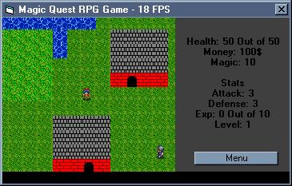



## MagicQuest RPG beta

### Description

this is a mini rpg that has a

map system, battle system,

and market system (where you buy stuff).

the reason why this is a beta is because of the bugs

i need to work out and the story is not nearly complete.

please VOTE and COMMENT!

[FIXED] I Organized and indented the code...

plus fixed a few bugs
 
### More Info
 

             |
---                |---
**Submitted On**   |2002-04-02 21:50:58
**By**             |[poop\_4\_brains](https://github.com/Planet-Source-Code/PSCIndex/blob/master/ByAuthor/poop-4-brains.md)
**Level**          |Intermediate
**User Rating**    |4.3 (13 globes from 3 users)
**Compatibility**  |VB 6\.0
**Category**       |[Coding Standards](https://github.com/Planet-Source-Code/PSCIndex/blob/master/ByCategory/coding-standards__1-43.md)
**World**          |[Visual Basic](https://github.com/Planet-Source-Code/PSCIndex/blob/master/ByWorld/visual-basic.md)
**Archive File**   |[MagicQuest68109422002\.zip](https://github.com/Planet-Source-Code/poop-4-brains-magicquest-rpg-beta__1-33368/archive/master.zip)

